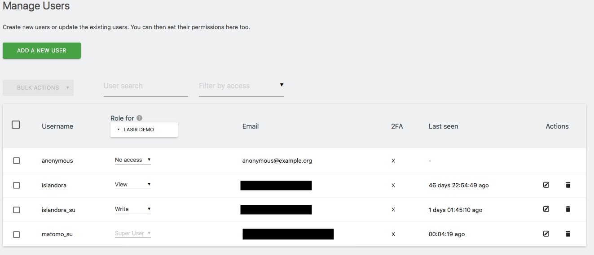

# Islandora Matomo Integration

## Overview

This module provides integration with the [Matomo Open Analytics Platform](http://Matomo.org/) via the Matomo Tracking 
HTTP API and also the Javascript library to allow Asynchronous/parallel tracking of current page load.

Islandora Matomo tracks Islandora object usage and (optionally) collection usage plus Authors and Departments if the r
equired metadata fields are correctly setup and configured in Solr as fields. 

Object usage is straight foward: each time a user navigates to an Islandora Object (wheter or not it located at the 
default path/islandora/object/pid), the request for that URL and the PID of the Object,
using a custom dimension, is recorded by Matomo.

Collection usage works differently. Each time an object is viewed, a "use" of the collection the Objects is a member of 
is recorded. This uses the ancestors solr field that keeps track of the whole membership tree.
If an object is a member of more than one collection and/or is inside nested collections, each collection gets a use. 
Collection usage is recorded using a custom Matomo dimension and reports are available under the "Visitors" tab in your 
Matomo Installation Dashboard, broken down by collection PID.

However, collections are also objects, so when the default collection object page is viewed, Matomo records a use of 
the collection as an object. 

Keep in mind that object usage and collection usage as describe in the previous paragraphs are not the same - 
object-level usage (including collections as objects) records how many times the object (or collection object) 
was viewed, whereas the collection usage records how many times objects in each collection were viewed. 
The two ways collections are counted are completely independent of each other.  

The module also tracks searches against Islandora using Islandora Solr Search, including searches that return zero results.

## Reports

Several Matomo report widgets (Real-time map, Visitor map, Islandora object pages, Islandora collection usage, Searches,
 and Searches returning no results) are available at admin/reports/islandora_matomo_reports to users who have been 
 assigned the "View Islandora Matomo reports" permission. 
 
 In order to enable these reports, you must enter your Matomo API key in the admin module's settings form. 
 Data for these reports is from the current day but you also have the option to select a custom range using the provided form.
 
 This is a proof-of-concept implementation and feedback is welcome.

## Collection-specific site IDs

This module allows administrators to associate a collection PID with a Matomo site ID, allowing analytics to be broken 
out by collection and you can also then assign multiple collections to a Virtual Viewer Segment. 
This feature is intended to allows site owners to view reports on their own collections. 
Collection and object page visits are recorded using only the collection-specific site ID, 
not both it and the general site ID. Site search and assets interaction (download, etc) tracking was also added.

If a collection is not associated with a site ID, page visits for it or its child collections use the general site ID. 

Islandora embeded Reports don't work for collection-specific site IDs, only the general site ID.

## Tracking usage of an entire Drupal (Islandora) site

If you want to use this module to provide analytics for your entire Islandora site, 
you can configure it to inject the JavaScript Tracking Code provided by Matomo into all non-Islandora-object pages. 
This feature is not intended to replace the contrib [Matomo Web Analytics](https://www.drupal.org/project/matomo) module, however. 

## Dependencies

* [Islandora](https://github.com/Islandora/islandora)
* [Islandora Solr](https://github.com/Islandora/islandora_solr_search)
* [A Matomo server](https://matomo.org)

## Configuration

### Deploy Matomo
You need to have a fully working Matomo Instance running to use this module.
Since deployment will vary significantly depending on your Server(s) reality we suggest to start by following the 
official guide at https://matomo.org/docs/installation/ and adapt accordingly. 

If you are running Islandora via Docker using the ISLE Project we have provided a skeleton approach here
https://github.com/mnylc/isle_matomo_docker that can be used as starting point. It deviates from the standard ISLE stack
because it uses nginx and php-fpm to provide a better performance but fully is compatible with ISLE.

We recommend to make Matomo available as a subdomain of your Islandora's primary domain to aid in Cross domain JS/AJAX 
calls.

### Setup Matomo for this module.

#### Create Matomo Sites
Once you have Matomo working you will need at least two Matomo "sites".

First Site will be used to track Objects and Collections and will be refered as "Default Site". Each site gets an Identifier
in the form of a sequentail Integer: (e.g 1). You can name the site any way you want but for this guide we will label it
"Islandora"

Second Site will be used to track Authors and Departments. You can name the site any way you want but for this guide we 
will label it "Islandora by Author/Department Dimension"

Both sites will share exactly the same setup configurations.

You can lear how to setup a site here: https://matomo.org/docs/manage-websites/

We do this to avoid double tracking of PIDs and URLS when applying multiple dimensions to the same URL but also to allow
separate reporting interface for Scholarly readership statistic needs. To learn more about Matomo custom dimensions please read https://matomo.org/faq/general/faq_21117/

#### Enable and setup Custom Dimensions

Once you have Both sites setup you will need to enable the Custom Dimensions Module following this guide: 
https://matomo.org/docs/custom-dimensions/

After enabling you will need to create four (4) dimensions for each site. Go to "Administration" (gear icon) and click
the "Custom dimensions" link under "Websites" you will find on your left navigation bar.

Please Follow the exact same order you see in the following Screenshot. This needs to be done for both Matomo sites.


Site 1 ("Islandora") will only use the first 2 dimensions, Site 2 ("Islandora by Author/Department Dimension") will use
the third and fourth ones. Matomo needs to have same dimensions in any site to make this work.

#### API interaction

With all those steps done you need now to make sure Islandora will be able to interact with the Tracking and Reporing
API that Matomo provides. Matomo uses two different levels of security. An API token unique to each Matomo user
and also a white list of Websites that can submit data to its API.

To fetch the token for your Admin user (the one you setup during Matomo deployment and probably the one you have been
using during this guide) go to "Administration" (gear icon) and click on the "API" link under "Platform" on your left 
navigation bar.

Under "User authentication" you will see an obscured Token field. Click on it and copy the Token value to some safe place.

E.g If what you see there is:

`&token_auth=01122207a7d6e74c02374edabf15736`

Copy only

`01122207a7d6e74c02374edabf15736

This token will be used by the Admin only report and functionality inside Islandora needed for this Module. Since this
Token will have Write permissions it is recommended to create at least one additional user with only VIEW permissions
inside Matomo. The following screenshot is an example of a production setup. 




After doing that repeat the process of copying the Token, by logging out, loggin in as the new user and copying the token 
for that new user to some safe place. That token will be also used inside Islandora to access View only functionality.

Extended information on managing users can be found here: https://matomo.org/docs/manage-users/


### Custom Matomo Widget

You are almost ready! Lastly, you need to download and enable a custom Matomo Widget we made to allow Islandora to embed
simpler Realtime and Visitor Maps directly in the Repository via Iframes. 

Note: The following instructions require you to execute commands via your Server's terminal and are written for an Ubuntu
based server.

1. Log into your Server's or Matomo Docker Container Terminal and go to the Matomo based installation folder.

```Shell
cd /yourmatomo/installation/folder 
apt-get update
apt-get install git
cd plugins/
git clone https://github.com/mnylc/plugin-UserCountryMapIslandora UserCountryMapIslandora
../console plugin:activate UserCountryMapIslandora
exit
```

That is all. Your new Plugin should be enabled and can also be used in your Matomo Dashboard directly.

## Setup Islandora Matomo Drupal Module

Now that you have Matomo working you need to setup Islandora to talk and read from Matomo

Visit admin/islandora/tools/matomo to configure this module. 

## Maintainer

* [Diego Pino at Metro.org](https://github.com/DiegoPino)


This module was written originally by [Mark Jordan](https://github.com/mjordan) as part of a large migration to 
Islandora from another repository platform that provided collection-level usage data 
(hence the focus on collections in this module). A lot has changed since then but the original spirit of the code still 
persists.Usage of existing Solr information to avoid page load
lag, Scholarly integration and Matomo JS API was added by Metro.org
